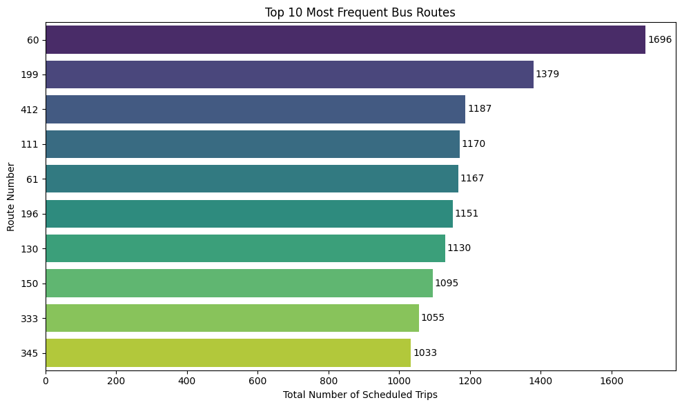
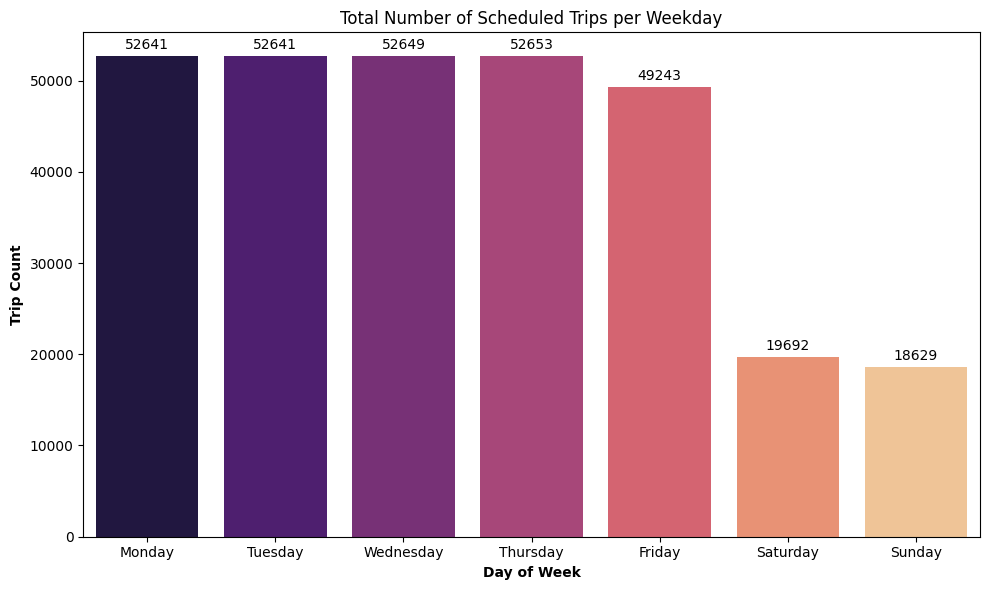
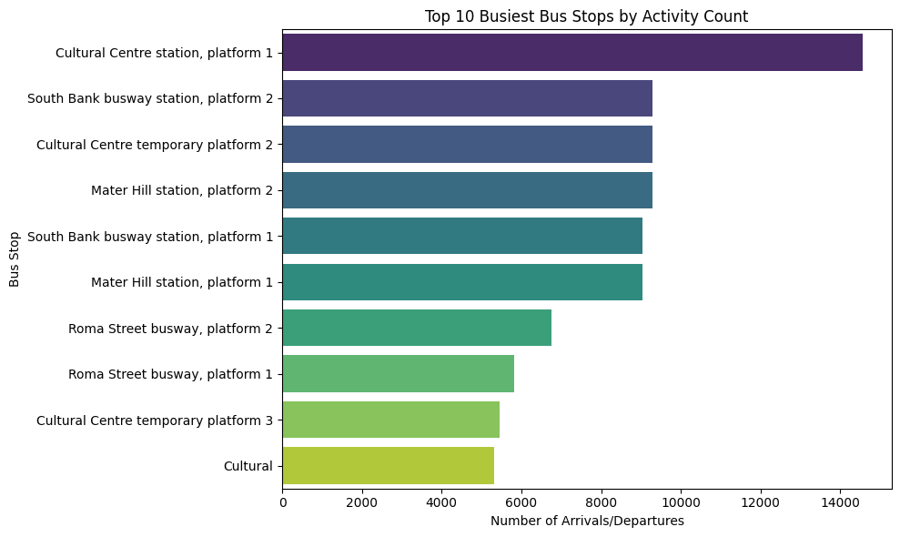
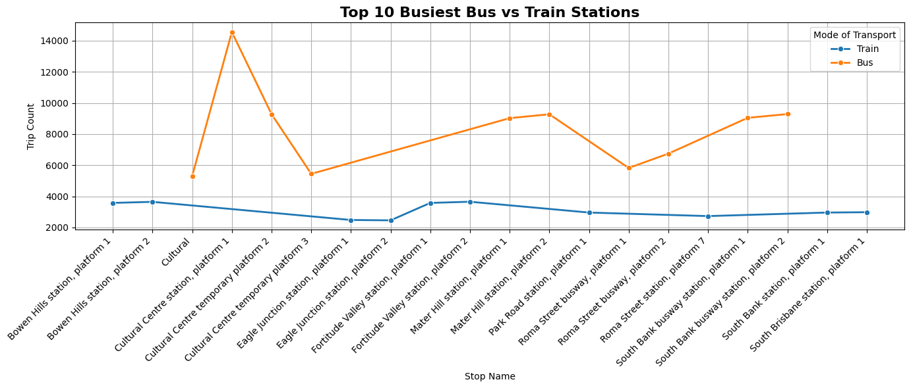
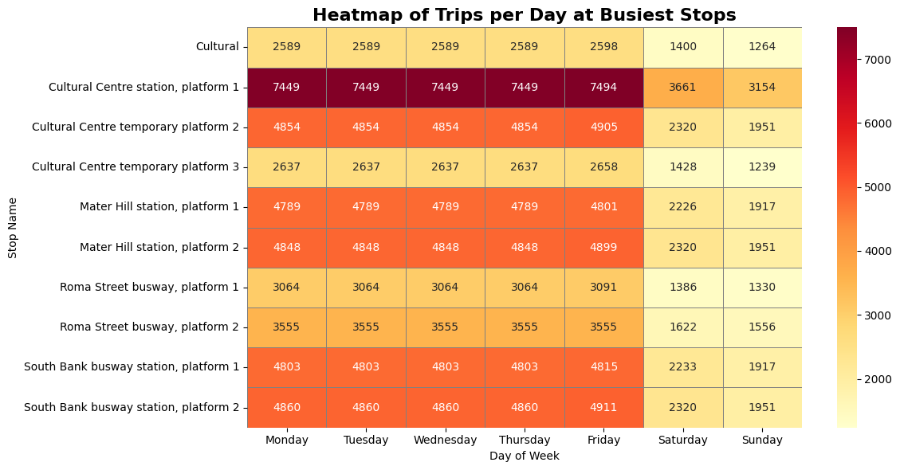
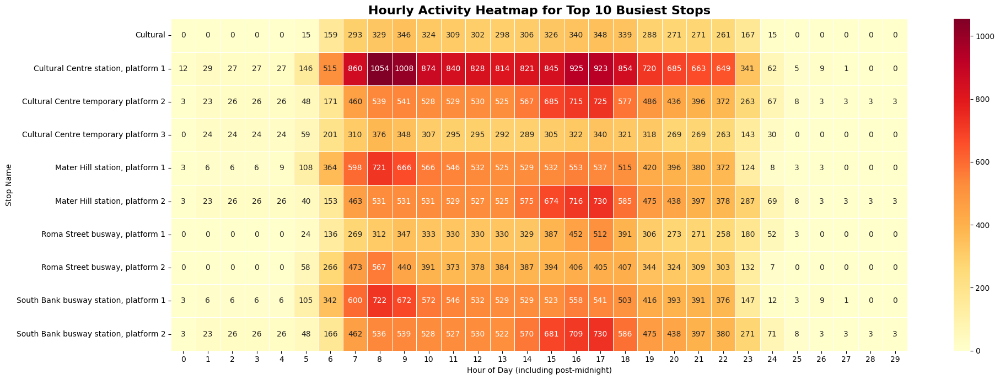

# An Analytical Report on the South East Queensland Public Transport Network

## Technology Stack
**Language:**  
- Python 3

**Data Manipulation & Analysis:**  
- **Pandas** – Flexible data structures and powerful data analysis tools  
- **SQLAlchemy** – ORM for managing SQL databases in Python  
- **Psycopg2** – PostgreSQL adapter for executing raw SQL queries

**Database:**  
- **PostgreSQL** – Relational database for structured GTFS data storage

**Data Visualization:**  
- **Matplotlib** & **Seaborn** – For creating static charts and statistical heatmaps  
- **Folium** – For rendering interactive geospatial maps with Leaflet.js

**Development & Version Control:**  
- **Jupyter Notebook** – For analysis, documentation, and interactive visualization  
- **Git & GitHub** – For version control and project presentation.
---

## Table of Contents

1. [Executive Summary](#executive-summary)  
2. [Introduction](#1-introduction)  
3. [Problem Statement & Hypotheses](#2-problem-statement--hypotheses)  
4. [Methodology](#3-methodology)  
5. [Analysis and Findings](#4-analysis-and-findings)  
6. [Limitations](#5-limitations-of-the-analysis)  
7. [Conclusion & Recommendations](#6-conclusion--recommendations)  
---
### 1. Executive Summary

This report presents a comprehensive analysis of the South East Queensland (SEQ) public transport network using scheduled data from Translink's General Transit Feed Specification (GTFS). The analysis reveals a system that is heavily **optimized for weekday commuters** and **geographically centered around the Brisbane CBD**.

Key findings indicate that a small number of high-frequency bus routes, such as the **CityGlider (60 & 61)** and university-focused **Route 66**, form the backbone of the network. Service levels drop by nearly 50% on weekends. The network's busiest hubs, including **King George Square Bus Station** and **Central Train Station**, are concentrated in the CBD and exhibit classic bimodal peak activity during morning (7-9 AM) and evening (4-6 PM) commuter periods. This analysis provides a foundational understanding of the network's operational structure, which is critical for urban planning and service optimization.

### 2. Introduction

Understanding the structure and usage patterns of a public transport network is essential for effective urban planning, resource allocation, and improving citizen mobility. This project undertakes a deep-dive analysis of the SEQ public transport system, operated by Translink. By processing and analyzing the publicly available GTFS data, we aim to transform raw, tabular data into actionable insights about the network's scale, key corridors, operational patterns, and geographic distribution.

### 3. Problem Statement & Hypotheses

The primary challenge is to process a complex, multi-file relational dataset to answer fundamental questions about the network's characteristics. This project tests the following hypotheses:

*   **Hypothesis 1 (Route Dominance):** A small subset of bus routes will account for a disproportionately large share of all scheduled trips.
*   **Hypothesis 2 (Weekday Bias):** Scheduled services will be significantly more frequent on weekdays compared to weekends, reflecting a commuter-centric design.
*   **Hypothesis 3 (CBD Centrality):** The busiest transport hubs (both bus and train) will be geographically concentrated in Brisbane's Central Business District (CBD).
*   **Hypothesis 4 (Commuter Peaks):** Network activity at major hubs will peak during typical morning and evening rush hours.

### 4. Methodology

The analysis was conducted using a two-phase methodology:

1.  **Data Processing (ETL):** Raw GTFS [`seq-translink-etl/data`](seq-translink-etl/data/) files were ingested into a PostgreSQL database using a Python script. This phase included critical data cleaning steps: handling missing values, correcting data types, removing duplicates, and standardizing text fields. This resulted in a clean, reliable, and analysis-ready relational database.
2.  **Data Analysis & Visualization:** SQL queries were executed against the database to aggregate and extract data. These queries utilized joins and Common Table Expressions (CTEs) to synthesize information from multiple tables. The resulting data was visualized using Python libraries (Matplotlib, Seaborn, Folium) to illustrate key findings.

### 5. Analysis and Findings

#### 5.1. Top 10 Most Frequent Routes

**Finding:** As predicted by **Hypothesis 1**, a few routes dominate service frequency. The CityGlider (60, 61) and UQ Lakes (66) routes have substantially more scheduled trips than others, establishing them as the primary arteries of the bus network.

#### 5.2. Service Levels by Day of the Week

**Finding:** This chart strongly supports **Hypothesis 2**. There is a clear and significant drop in service levels on Saturday and Sunday compared to the consistent, high volume of trips from Monday to Friday.

#### 5.3. Busiest Transport Hubs

**Finding:** The busiest bus and train stops are overwhelmingly located in or directly adjacent to the Brisbane CBD (e.g., King George Square, Cultural Centre, Central Station). This confirms **Hypothesis 3**, highlighting the CBD's role as the network's central nexus.

#### 5.4. Geographic Distribution of All Stops

**Finding:** This interactive map shows a high density of stops in the urban core of Brisbane, with services extending to surrounding regions. The clustering capability allows for an intuitive exploration of service coverage.

#### 5.5. Weekly & Hourly Activity Heatmaps

**Finding:** These heatmaps provide compelling evidence for **Hypothesis 4**. The weekly heatmap reinforces the weekday vs. weekend service drop-off across all major stops. The hourly heatmap clearly illustrates the bimodal commuter pattern, with activity peaking between 7-9 AM and 4-6 PM.

### 6. Limitations of the Analysis

It is crucial to acknowledge the limitations of this study, which offer avenues for future work:

*   **Scheduled vs. Actual Data:** This analysis is based on the GTFS *schedule*. It does not reflect real-world conditions such as traffic delays, vehicle breakdowns, or trip cancellations.
*   **No Passenger Data:** The metric "activity count" (number of scheduled arrivals/departures) is a proxy for how "busy" a stop is. It does not represent actual passenger numbers (boardings and alightings).
*   **Static Dataset:** The analysis is a snapshot based on a single GTFS data release. It does not capture seasonal variations, holiday schedules, or long-term trends in the network.

### 7. Conclusion & Recommendations

This analysis successfully processed raw transit data to reveal the core operational characteristics of the SEQ public transport network. The findings confirmed all initial hypotheses, painting a picture of a system that is **CBD-centric and tailored to a weekday-commuting population**.

Based on these findings and limitations, the following next steps are recommended:

*   **Performance Analysis:** Integrate real-time GTFS data to analyze on-time performance and identify routes or times of day prone to delays.
*   **Accessibility Study:** Use network graph analysis to identify "transport deserts" or areas with poor access to key amenities like hospitals and employment centers.
*   **Develop an Interactive Dashboard:** Create a web-based dashboard (using Streamlit or Dash) to allow planners and the public to explore these insights dynamically.